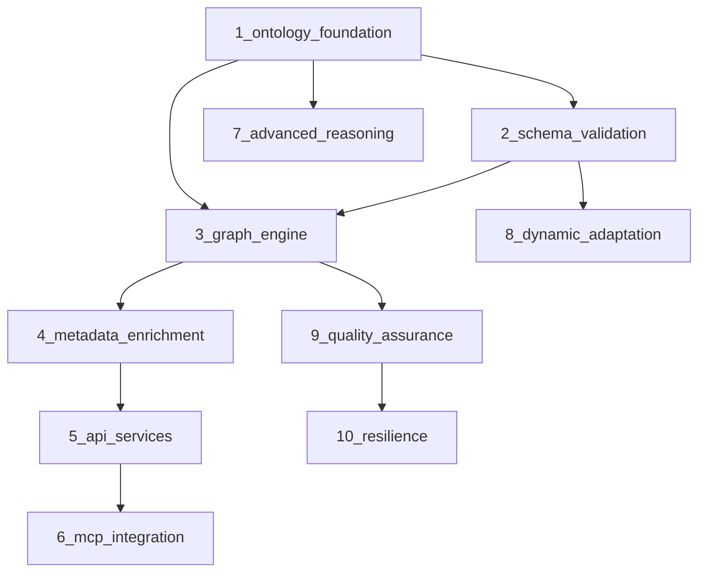

# Knowledge Graph Systems Design

## Overview

This design document outlines the knowledge graph systems that provide semantic
enrichment, metadata validation, and relationship modeling for the agentic
neurodata conversion pipeline. The system uses NWB-LinkML schema and instance
files as the canonical ontology source to generate RDF triples, JSON-LD
contexts, and SHACL shapes. It maintains a rich semantic model of neuroscience
entities, relationships, and provenance while supporting automated metadata
enrichment and complex validation queries.

## Modular Architecture Approach

The knowledge graph system is designed with a **modular architecture** that enables:

### 🎯 **Implementation Benefits**
- **Incremental Development**: Each module can be implemented and tested independently
- **Parallel Development**: Multiple developers can work on different modules simultaneously
- **Easy Debugging**: Clear module boundaries make it easier to isolate and fix issues
- **Testability**: Each module has well-defined inputs/outputs for unit testing
- **Maintainability**: Changes in one module have minimal impact on others

### 📦 **Module Design Principles**
1. **Single Responsibility**: Each module has one primary purpose
2. **Loose Coupling**: Modules communicate through well-defined interfaces
3. **High Cohesion**: Related functionality is grouped together
4. **Dependency Injection**: Modules receive dependencies rather than creating them
5. **Interface Segregation**: Modules only depend on interfaces they actually use

### 🔧 **Module Structure**
Each module follows a consistent structure:
```
module_name/
├── __init__.py           # Module interface and exports
├── core.py              # Core business logic
├── models.py            # Data models and schemas
├── interfaces.py        # Abstract interfaces and protocols
├── config.py            # Module-specific configuration
├── exceptions.py        # Module-specific exceptions
└── tests/               # Comprehensive test suite
    ├── test_core.py
    ├── test_models.py
    └── fixtures/
```

### 🚀 **Development Workflow**
1. **Start with Core Modules**: Implement foundational modules first
2. **Interface-First Design**: Define interfaces before implementation
3. **Test-Driven Development**: Write tests alongside implementation
4. **Integration Testing**: Test module interactions systematically
5. **Documentation**: Maintain clear module documentation

## Architecture

### Modular System Architecture

```
Knowledge Graph Systems (Modular Ontology-First Architecture)

📦 CORE MODULES (Foundation Layer)
├── 🧠 ontology_foundation/         [Module 1: Ontology Foundation]
│   ├── nwb_ontology_manager.py   # Central orchestrator
│   ├── multi_ontology_hub.py     # NIFSTD, UBERON, CHEBI, OBI, PATO, NCBITaxon
│   ├── semantic_alignment.py     # Ontology-schema mappings
│   └── neuro_reasoning.py         # Domain-specific reasoning

├── 📋 schema_validation/           [Module 2: Schema & Validation]
│   ├── linkml_processor.py       # NWB-LinkML schema processing
│   ├── dynamic_discovery.py      # Runtime schema discovery
│   ├── context_generator.py      # JSON-LD context generation
│   ├── shacl_generator.py        # SHACL shapes creation
│   └── owl_generator.py          # OWL/RDF schema generation

├── 🗃️ graph_engine/              [Module 3: Core Graph Engine]
│   ├── rdf_store.py              # RDF storage management
│   ├── sparql_engine.py          # Query processing
│   ├── inference_engine.py       # Reasoning capabilities
│   └── entity_manager.py         # Entity lifecycle management

📦 ENHANCEMENT MODULES (Processing Layer)
├── 🔍 metadata_enrichment/        [Module 4: Metadata Enhancement]
│   ├── entity_resolver.py        # Entity resolution
│   ├── relationship_inference.py # Semantic relationships
│   ├── property_discovery.py     # Dynamic properties
│   ├── plausibility_validator.py # Biological validation
│   └── confidence_scorer.py      # Confidence assessment

├── 🌐 api_services/               [Module 5: API Services]
│   ├── rest_api.py               # REST endpoints
│   ├── sparql_endpoint.py        # SPARQL service
│   ├── query_interface.py        # Query abstraction
│   └── export_services.py        # Format exports

├── 🔗 mcp_integration/           [Module 6: MCP Integration]
│   ├── mcp_tools.py              # MCP tool implementations
│   ├── workflow_integration.py   # Workflow coordination
│   └── agent_interface.py        # Agent communication

📦 ADVANCED MODULES (Advanced Features Layer)
├── 🧮 advanced_reasoning/         [Module 7: Advanced Reasoning]
│   ├── anatomical_reasoner.py    # Anatomy hierarchies
│   ├── temporal_modeler.py       # Time relationships
│   ├── multimodal_integrator.py  # Cross-modal integration
│   ├── design_validator.py       # Experimental design
│   └── semantic_harmonizer.py    # Cross-study harmonization

├── 🔄 dynamic_adaptation/         [Module 8: Dynamic Adaptation]
│   ├── schema_discoverer.py      # Schema discovery
│   ├── adaptive_manager.py       # Adaptive entities
│   ├── runtime_extender.py       # Runtime extensions
│   └── pattern_recognizer.py     # Pattern recognition

├── 📊 quality_assurance/          [Module 9: Quality & Monitoring]
│   ├── data_quality.py           # Quality assessment
│   ├── lineage_tracker.py        # Provenance tracking
│   ├── consistency_checker.py    # Consistency validation
│   └── monitoring.py             # System monitoring

📦 PRODUCTION MODULES (Production Readiness Layer)
└── 🛡️ resilience/                [Module 10: Resilience & Error Handling]
    ├── error_handler.py          # Error management
    ├── recovery_manager.py       # Recovery strategies
    ├── resource_manager.py       # Resource optimization
    └── conflict_resolver.py      # Conflict resolution
```

### 🔗 **Module Dependencies**



### ⚡ **Module Implementation Priority**

**Phase 1: Core Foundation (Dependencies: None)**
1. `ontology_foundation` - Essential domain knowledge
2. `schema_validation` - NWB-LinkML processing
3. `graph_engine` - Basic RDF operations

**Phase 2: Enhancement Services (Dependencies: Phase 1)**
4. `metadata_enrichment` - Basic enrichment (requires: graph_engine)
5. `api_services` - External interfaces (requires: metadata_enrichment)
6. `mcp_integration` - MCP connectivity (requires: api_services)

**Phase 3: Advanced Features (Dependencies: Phase 1)**
7. `advanced_reasoning` - Complex reasoning (requires: ontology_foundation)
8. `dynamic_adaptation` - Runtime adaptation (requires: schema_validation)
9. `quality_assurance` - Quality systems (requires: graph_engine)

**Phase 4: Production Readiness (Dependencies: Phase 3)**
10. `resilience` - Error handling & monitoring (requires: quality_assurance)

### Data Flow

````
NWB/NWB-LinkML Instance → Dynamic Schema Discovery → LinkML Schema Validation → SHACL Validation → RDF Generation (JSON-LD/Turtle/N-Triples) → KG Ingestion
                                   ↓                                ↓
                         Runtime Schema Extension         Domain Ontologies (NIFSTD, UBERON) → Knowledge Graph → SPARQL Queries → Validation/QA Results
                                   ↓                                ↓
                         Adaptive Property Mapping       Provenance Tracking (PROV-O + schema version) → RDF Store → Export Services → Multiple Formats
````

### 🔧 **Module Interface Design**

Each module exposes a clean interface for integration and testing:

```python
# Example: Module Interface Pattern
from abc import ABC, abstractmethod
from typing import Dict, Any, List, Optional

class ModuleInterface(ABC):
    """Base interface for all knowledge graph modules."""

    @abstractmethod
    def initialize(self, config: Dict[str, Any]) -> None:
        """Initialize module with configuration."""
        pass

    @abstractmethod
    def health_check(self) -> Dict[str, Any]:
        """Return module health status."""
        pass

    @abstractmethod
    def get_dependencies(self) -> List[str]:
        """Return list of required module dependencies."""
        pass

# Example: Ontology Foundation Module Interface
class OntologyFoundationInterface(ModuleInterface):
    @abstractmethod
    def load_ontologies(self, ontology_configs: Dict[str, Any]) -> bool:
        """Load and initialize domain ontologies."""
        pass

    @abstractmethod
    def align_with_schema(self, schema_data: Dict[str, Any]) -> Dict[str, Any]:
        """Create semantic alignments with NWB-LinkML schema."""
        pass

    @abstractmethod
    def get_reasoning_engine(self) -> 'NeuroReasoningEngine':
        """Get neuroscience reasoning engine instance."""
        pass
```

### 📋 **Configuration Management**

Each module has its own configuration schema:

```python
# config/ontology_foundation.yaml
ontology_foundation:
  enabled_ontologies:
    - nifstd
    - uberon
    - chebi
    - obi
    - pato
    - ncbitaxon

  cache_settings:
    enable_cache: true
    cache_ttl: 3600
    cache_size_mb: 500

  reasoning:
    enable_inference: true
    max_reasoning_depth: 5
    reasoning_timeout: 30

# config/schema_validation.yaml
schema_validation:
  nwb_linkml:
    schema_version: "latest"
    validation_level: "strict"
    cache_artifacts: true

  dynamic_discovery:
    enable_discovery: true
    confidence_threshold: 0.7
    max_dynamic_entities: 1000
```

### 🧪 **Testing Strategy**

Each module includes comprehensive tests:

```python
# tests/test_ontology_foundation.py
import pytest
from knowledge_graph.ontology_foundation import OntologyFoundationModule

class TestOntologyFoundation:
    @pytest.fixture
    def module(self):
        config = {
            "enabled_ontologies": ["nifstd", "uberon"],
            "cache_settings": {"enable_cache": false}
        }
        module = OntologyFoundationModule()
        module.initialize(config)
        return module

    def test_module_initialization(self, module):
        assert module.health_check()["status"] == "healthy"

    def test_ontology_loading(self, module):
        result = module.load_ontologies({})
        assert result is True

    def test_schema_alignment(self, module):
        schema_data = {"classes": [], "slots": []}
        result = module.align_with_schema(schema_data)
        assert "alignments" in result
        assert isinstance(result["alignments"], list)
```

## Modular Implementation Details

## Module 1: Ontology Foundation Layer

The ontology foundation layer forms the semantic core of the knowledge graph system, providing comprehensive neuroscience domain knowledge integration and semantic reasoning capabilities optimized specifically for NWB data.

### NWB Ontology Manager (Central Orchestrator)

The NWB Ontology Manager serves as the central coordination hub for all ontological operations:

```python
# ontology_foundation/nwb_ontology_manager.py
from typing import Dict, Any, List
from .interfaces import OntologyFoundationInterface
from .multi_ontology_hub import MultiOntologyIntegrationHub
from .semantic_alignment import SemanticAlignmentEngine
from .neuro_reasoning import NeuroReasoningEngine

class NWBOntologyManager(OntologyFoundationInterface):
    """Central orchestrator for all ontology operations - Module 1 Entry Point."""

    def __init__(self):
        self._initialized = False
        self._config = None
        self._components = {}

    def initialize(self, config: Dict[str, Any]) -> None:
        """Initialize module with configuration."""
        self._config = config

        # Initialize components with dependency injection
        self._components = {
            'multi_ontology_hub': MultiOntologyIntegrationHub(config.get('ontologies', {})),
            'semantic_alignment_engine': SemanticAlignmentEngine(config.get('alignment', {})),
            'neuro_reasoning_engine': NeuroReasoningEngine(config.get('reasoning', {}))
        }

        # Initialize all components
        for component in self._components.values():
            component.initialize()

        self._initialized = True

    def health_check(self) -> Dict[str, Any]:
        """Return module health status."""
        if not self._initialized:
            return {"status": "not_initialized", "components": {}}

        component_health = {}
        for name, component in self._components.items():
            component_health[name] = component.health_check()

        overall_status = "healthy" if all(
            h["status"] == "healthy" for h in component_health.values()
        ) else "unhealthy"

        return {
            "status": overall_status,
            "components": component_health,
            "module": "ontology_foundation"
        }

    def get_dependencies(self) -> List[str]:
        """Return list of required module dependencies."""
        return []  # Foundation module has no dependencies

    def load_ontologies(self, ontology_configs: Dict[str, Any]) -> bool:
        """Load and initialize domain ontologies."""
        return self._components['multi_ontology_hub'].load_core_ontologies(ontology_configs)

    def align_with_schema(self, schema_data: Dict[str, Any]) -> Dict[str, Any]:
        """Create semantic alignments with NWB-LinkML schema."""
        return self._components['semantic_alignment_engine'].align_with_nwb_linkml(schema_data)

    def get_reasoning_engine(self) -> NeuroReasoningEngine:
        """Get neuroscience reasoning engine instance."""
        return self._components['neuro_reasoning_engine']
```

### Multi-Ontology Integration Hub

Comprehensive integration of essential neuroscience ontologies:

#### NIFSTD (Neuroscience Information Framework)
- **Brain region hierarchies**: Complete anatomical classification from cortical areas to subcortical structures
- **Cell type taxonomies**: Neuronal and glial cell classifications with morphological and functional properties
- **Neurotransmitter systems**: Complete mapping of chemical signaling pathways
- **Technique and method classifications**: Experimental and analytical method ontologies

#### UBERON (Anatomical Structures)
- **Cross-species anatomy**: Unified anatomical framework across model organisms
- **Developmental relationships**: Temporal anatomical development stages
- **Spatial relationships**: Anatomical positioning and connectivity patterns

#### CHEBI (Chemical Entities of Biological Interest)
- **Neurotransmitter chemistry**: Complete chemical classification of signaling molecules
- **Drug and compound ontologies**: Pharmacological agents and experimental compounds
- **Metabolic pathway integration**: Biochemical process representation

#### OBI (Ontology for Biomedical Investigations)
- **Experimental design patterns**: Protocol and methodology classifications
- **Measurement technique ontologies**: Recording and stimulation method semantics
- **Data analysis method classifications**: Statistical and computational technique taxonomies

#### PATO (Phenotype And Trait Ontology)
- **Behavioral phenotypes**: Comprehensive behavioral characteristic classifications
- **Physiological qualities**: Neural activity and physiological measurement qualities
- **Morphological attributes**: Structural and architectural properties

#### NCBITaxon (Species Taxonomy)
- **Model organism hierarchies**: Complete taxonomic classification for research species
- **Strain-species relationships**: Laboratory strain genealogy and characteristics
- **Genetic background information**: Inbred and outbred strain classifications

### Semantic Alignment Engine

Advanced semantic mapping between NWB-LinkML schema and ontology concepts:

```python
class SemanticAlignmentEngine:
    """Creates precise semantic mappings between NWB-LinkML and domain ontologies."""

    def create_semantic_alignments(self):
        """Establish comprehensive semantic alignments."""

        # NWB Device classes → OBI measurement techniques
        self.create_alignment(
            nwb_class="Device",
            ontology_concept="OBI:measurement_technique",
            relationship_type="owl:equivalentClass",
            confidence_score=0.95
        )

        # NWB Subject → UBERON organism + NCBITaxon species
        self.create_complex_alignment(
            nwb_class="Subject",
            ontology_concepts={
                "UBERON:organism": "owl:subClassOf",
                "NCBITaxon:species": "neuro:hasSpecies"
            }
        )

        # NWB TimeSeries → PATO qualities + temporal relationships
        self.create_temporal_alignment(
            nwb_class="TimeSeries",
            temporal_ontology="http://www.w3.org/2006/time",
            quality_ontology="PATO:quality"
        )
```

### NWB-Specific Semantic Extensions

Specialized semantic models that extend beyond generic ontologies:

#### Electrode Array Geometries
- **Spatial relationship modeling**: 3D coordinate systems and electrode positioning
- **Array topology semantics**: Linear, grid, and custom array configurations
- **Signal pathway representation**: Electrical signal routing and processing chains

#### Recording Configuration Semantics
- **Multi-channel recording setups**: Channel mapping and signal correlation
- **Sampling rate hierarchies**: Temporal resolution relationships across modalities
- **Filtering and processing pipelines**: Signal transformation semantic chains

#### Behavioral Paradigm Classifications
- **Task taxonomy**: Hierarchical classification of experimental tasks and paradigms
- **Stimulus-response relationships**: Temporal and causal relationship modeling
- **Experimental condition semantics**: Control and experimental condition relationships

#### Analysis Method Taxonomies
- **Algorithm parameter spaces**: Mathematical relationship modeling for analysis methods
- **Statistical method appropriateness**: Context-dependent method selection guidance
- **Result interpretation frameworks**: Semantic models for analysis result interpretation

### Neuroscience Reasoning Engine

Domain-specific reasoning capabilities for scientific validation:

```python
class NeuroReasoningEngine:
    """Specialized reasoning engine for neuroscience domain knowledge."""

    def anatomical_hierarchy_reasoning(self, brain_region: str) -> List[str]:
        """Perform anatomical hierarchy reasoning."""
        # Navigate UBERON anatomical hierarchies
        # Validate electrode placement feasibility
        # Check developmental stage compatibility

    def temporal_relationship_validation(self, experimental_timeline: Dict) -> ValidationResult:
        """Validate temporal relationships in experimental design."""
        # Check stimulus-response temporal consistency
        # Validate behavioral state transition logic
        # Verify cross-modal synchronization requirements

    def biological_plausibility_assessment(self, metadata: Dict) -> PlausibilityReport:
        """Assess biological plausibility of experimental parameters."""
        # Species-appropriate measurement validation
        # Developmental stage consistency checking
        # Anatomical-functional relationship verification
```

### Schema and Validation Layer (NWB-LinkML)

- Source of truth: NWB-LinkML schema defines classes and slots for the NWB domain.
- Generated artifacts: JSON-LD @context, SHACL shapes, and OWL/RDF schema; all artifacts are versioned.
- Validation pipeline: Validate LinkML instances (YAML/JSON) against the schema, then run SHACL validation over the RDF graph.
- Triple generation: Use LinkML-generated JSON-LD @context to ensure consistent IRIs/prefixes for ingestion into the RDF store.

### Dynamic Schema Discovery Engine

The Dynamic Schema Discovery Engine handles arbitrary NWB content that extends beyond the predefined NWB-LinkML schema, enabling robust knowledge graph creation from any NWB data structure.

#### Core Capabilities
- **Runtime Schema Detection**: Automatically discovers entity types and properties from unknown NWB data structures
- **Adaptive Entity Creation**: Creates flexible entity classes that can accommodate arbitrary metadata fields
- **Type Inference**: Intelligently maps Python/NumPy data types to appropriate RDF datatypes
- **Nested Structure Handling**: Processes complex nested dictionaries and arrays with proper RDF representation
- **Array Schema Discovery**: Handles multi-dimensional arrays with shape and dtype metadata preservation

#### Schema Discovery Process

```python
# Dynamic Schema Discovery Pipeline
class DynamicSchemaDiscovery:
    """Discovers and manages dynamic schemas from arbitrary NWB data structures."""

    def discover_from_nwb(self, nwb_data: Dict[str, Any], entity_path: str = "") -> EntitySchema:
        """
        Discover schema from NWB data structure.

        1. Entity Type Inference:
           - Check for neurodata_type indicators
           - Analyze data structure patterns (TimeSeries, Intervals, etc.)
           - Use path-based inference for known NWB patterns

        2. Property Discovery:
           - Handle primitive types (str, int, float, bool)
           - Process NumPy arrays with dtype and shape preservation
           - Discover nested object properties recursively
           - Analyze sequence types with element consistency

        3. RDF Mapping Generation:
           - Create dynamic namespaces for unknown entities
           - Generate appropriate RDFS/OWL class definitions
           - Map Python/NumPy types to XSD datatypes
           - Preserve array metadata and nested structures
        """

    def _infer_entity_type(self, data: Dict[str, Any], path: str) -> str:
        """
        Infer entity type from data structure and path patterns:

        Known NWB Patterns:
        - TimeSeries: data + timestamps keys
        - Intervals: start_time + stop_time keys
        - Electrodes: location/impedance patterns
        - Units: spike_times patterns
        - Devices: manufacturer/description patterns
        - Modules: acquisition/processing/analysis paths

        Fallback: Path-based or generic DynamicEntity
        """

    def _discover_property(self, prop_name: str, value: Any, full_path: str) -> PropertySchema:
        """
        Comprehensive property discovery:

        Array Handling:
        - Preserve NumPy dtype and shape information
        - Sample array values for examples
        - Handle multi-dimensional structures

        Nested Objects:
        - Recursively discover nested properties
        - Create sub-entity schemas for complex structures
        - Maintain parent-child relationships

        Type Mapping:
        - Python primitives → XSD datatypes
        - NumPy types → appropriate RDF representations
        - Custom NWB types → dynamic ontology classes
        """
```

#### Adaptive Entity Management

```python
class AdaptiveEntityManager(EntityManager):
    """Extended entity manager for dynamic content."""

    def create_dynamic_entity(self, entity_id: str, entity_schema: EntitySchema,
                            metadata: Dict[str, Any]) -> URIRef:
        """
        Create entity with dynamically discovered schema:

        1. Generate RDF class URI from discovered entity type
        2. Create all discovered properties as RDF properties
        3. Handle array properties with shape/dtype metadata
        4. Preserve nested structures with sub-entities
        5. Maintain provenance of schema discovery process
        """

    def _handle_array_property(self, entity_uri: URIRef, prop_name: str,
                              array_value: Any, prop_schema: PropertySchema) -> None:
        """
        Handle array properties with full metadata preservation:

        - Store array shape and dtype as metadata properties
        - Sample representative values for searchability
        - Create array-specific validation rules
        - Maintain links to original data location
        """

    def _handle_nested_property(self, entity_uri: URIRef, prop_name: str,
                               nested_value: Dict, prop_schema: PropertySchema) -> None:
        """
        Handle nested object properties:

        - Create sub-entities for complex nested structures
        - Establish parent-child relationships
        - Recursively process nested properties
        - Maintain hierarchical organization in RDF
        """
```

#### Runtime Schema Extension

```python
class RuntimeSchemaExtension:
    """Manages runtime extension of NWB-LinkML schema with discovered content."""

    def extend_schema(self, base_schema: LinkMLSchema,
                     discovered_entities: Dict[str, EntitySchema]) -> ExtendedSchema:
        """
        Extend base NWB-LinkML schema with dynamically discovered entities:

        1. Create schema extensions for unknown entity types
        2. Generate LinkML class definitions for discovered entities
        3. Create slot definitions for discovered properties
        4. Maintain inheritance relationships where applicable
        5. Generate updated JSON-LD contexts and SHACL shapes
        """

    def generate_dynamic_shacl(self, entity_schemas: Dict[str, EntitySchema]) -> str:
        """
        Generate SHACL shapes for dynamically discovered entities:

        - Create sh:NodeShape for each discovered entity type
        - Generate sh:property definitions for all discovered properties
        - Include datatype constraints and cardinality rules
        - Handle array properties with appropriate constraints
        """

    def update_jsonld_context(self, base_context: Dict,
                            discovered_schemas: Dict[str, EntitySchema]) -> Dict:
        """
        Update JSON-LD context with dynamic entity mappings:

        - Add namespace mappings for dynamic entities
        - Include property definitions with appropriate IRI mappings
        - Maintain consistency with base NWB-LinkML context
        - Support array and nested object serialization
        """
```

## Advanced Dynamic Information Modeling Layer

The system includes sophisticated capabilities for capturing the dynamic nature of information with contextual semantic relationships and evolving information structures.

### Dynamic Semantic Relationship Engine

```python
class DynamicSemanticRelationshipEngine:
    """Captures and models dynamic semantic relationships in NWB data."""

    def __init__(self, ontology_manager: NWBOntologyManager):
        self.ontology_manager = ontology_manager
        self.temporal_reasoner = TemporalSemanticReasoner()
        self.contextual_analyzer = ContextualSemanticAnalyzer()
        self.relationship_classifier = RelationshipClassifier()

    def discover_dynamic_relationships(self, nwb_data: Dict, context: Dict) -> List[DynamicRelationship]:
        """
        Discover and model dynamic semantic relationships:

        1. Temporal Dependencies: Time-based causality and sequence relationships
        2. Contextual Associations: Environment-dependent semantic connections
        3. Emergent Properties: Relationships that arise from data combinations
        4. State Transitions: Dynamic state changes and their triggers
        5. Multi-Scale Interactions: Cross-level semantic relationships
        """

        relationships = []

        # Discover temporal semantic relationships
        temporal_rels = self.temporal_reasoner.analyze_temporal_semantics(nwb_data)
        relationships.extend(temporal_rels)

        # Identify contextual semantic associations
        contextual_rels = self.contextual_analyzer.discover_context_dependent_semantics(nwb_data, context)
        relationships.extend(contextual_rels)

        # Model emergent semantic properties
        emergent_rels = self._discover_emergent_relationships(nwb_data)
        relationships.extend(emergent_rels)

        return relationships

class TemporalSemanticReasoner:
    """Specialized reasoning for temporal semantic relationships."""

    def analyze_temporal_semantics(self, nwb_data: Dict) -> List[TemporalRelationship]:
        """
        Analyze temporal semantic patterns:

        - Event Causality: stimulus → neural_response → behavior
        - Process Phases: baseline → stimulus → response → recovery
        - State Transitions: rest → active → fatigue → recovery
        - Temporal Hierarchies: trial → session → experiment → study
        - Synchronization: cross-modal temporal alignment semantics
        """

        temporal_relationships = []

        # Analyze event sequences for causal relationships
        if self._has_event_data(nwb_data):
            causal_rels = self._discover_causal_relationships(nwb_data)
            temporal_relationships.extend(causal_rels)

        # Model process phases with semantic transitions
        phase_rels = self._model_process_phases(nwb_data)
        temporal_relationships.extend(phase_rels)

        # Discover temporal hierarchies with semantic nesting
        hierarchy_rels = self._discover_temporal_hierarchies(nwb_data)
        temporal_relationships.extend(hierarchy_rels)

        return temporal_relationships

class ContextualSemanticAnalyzer:
    """Analyzes context-dependent semantic relationships."""

    def discover_context_dependent_semantics(self, nwb_data: Dict, context: Dict) -> List[ContextualRelationship]:
        """
        Discover semantic relationships that depend on experimental context:

        - Environmental Modulation: how environmental factors affect semantic meaning
        - Behavioral State Dependencies: semantic changes based on animal state
        - Experimental Paradigm Context: paradigm-specific semantic interpretations
        - Multi-Modal Context: how different modalities influence semantic meaning
        - Dynamic Protocol Adaptations: context-driven protocol modifications
        """

        contextual_relationships = []

        # Analyze environmental semantic modulation
        env_rels = self._analyze_environmental_semantics(nwb_data, context)
        contextual_relationships.extend(env_rels)

        # Model behavioral state-dependent semantics
        behavioral_rels = self._model_behavioral_context_semantics(nwb_data, context)
        contextual_relationships.extend(behavioral_rels)

        # Discover paradigm-specific semantic patterns
        paradigm_rels = self._discover_paradigm_semantics(nwb_data, context)
        contextual_relationships.extend(paradigm_rels)

        return contextual_relationships
```

### Dynamic Class Generation and Evolution

```python
class DynamicClassManager:
    """Manages dynamic generation and evolution of semantic classes."""

    def __init__(self, ontology_manager: NWBOntologyManager):
        self.ontology_manager = ontology_manager
        self.class_evolution_tracker = ClassEvolutionTracker()
        self.semantic_merger = SemanticClassMerger()

    def generate_dynamic_classes(self, discovered_patterns: List[SemanticPattern]) -> List[DynamicClass]:
        """
        Generate dynamic classes that capture evolving information patterns:

        1. Pattern-Based Classes: Classes derived from recurring semantic patterns
        2. Context-Sensitive Classes: Classes that adapt based on experimental context
        3. Temporal Classes: Classes that represent time-dependent semantic concepts
        4. Emergent Concept Classes: Classes for concepts that emerge from data analysis
        5. Multi-Modal Integration Classes: Classes that bridge different data modalities
        """

        dynamic_classes = []

        for pattern in discovered_patterns:
            if pattern.type == 'recurring_semantic_pattern':
                cls = self._create_pattern_based_class(pattern)
                dynamic_classes.append(cls)

            elif pattern.type == 'contextual_adaptation':
                cls = self._create_context_sensitive_class(pattern)
                dynamic_classes.append(cls)

            elif pattern.type == 'temporal_evolution':
                cls = self._create_temporal_class(pattern)
                dynamic_classes.append(cls)

            elif pattern.type == 'emergent_concept':
                cls = self._create_emergent_concept_class(pattern)
                dynamic_classes.append(cls)

        return dynamic_classes

    def evolve_existing_classes(self, new_data: Dict, existing_classes: List[DynamicClass]) -> List[ClassEvolution]:
        """
        Evolve existing classes based on new information:

        - Property Extension: Add new properties discovered in data
        - Relationship Enhancement: Enrich relationships with new semantic connections
        - Constraint Refinement: Update constraints based on new data patterns
        - Semantic Enrichment: Enhance semantic meaning with new ontological mappings
        - Context Expansion: Expand contextual applicability of classes
        """

        evolutions = []

        for cls in existing_classes:
            evolution = self.class_evolution_tracker.analyze_evolution_needs(cls, new_data)
            if evolution.has_changes():
                evolved_class = self._evolve_class(cls, evolution)
                evolutions.append(ClassEvolution(original=cls, evolved=evolved_class, changes=evolution))

        return evolutions

class SemanticRelationshipGraph:
    """Models complex semantic relationships as a dynamic graph."""

    def __init__(self):
        self.relationship_types = self._initialize_relationship_types()
        self.relationship_graph = nx.MultiDiGraph()  # Support multiple relationship types
        self.semantic_weights = {}
        self.contextual_modifiers = {}

    def _initialize_relationship_types(self) -> Dict[str, RelationshipType]:
        """Initialize comprehensive relationship type taxonomy."""
        return {
            # Temporal Relationships
            'temporal_precedes': RelationshipType('temporal_precedes', 'temporal', directional=True),
            'temporal_overlaps': RelationshipType('temporal_overlaps', 'temporal', directional=False),
            'temporal_causes': RelationshipType('temporal_causes', 'causal', directional=True),
            'temporal_enables': RelationshipType('temporal_enables', 'enablement', directional=True),

            # Spatial Relationships
            'spatial_contains': RelationshipType('spatial_contains', 'spatial', directional=True),
            'spatial_adjacent': RelationshipType('spatial_adjacent', 'spatial', directional=False),
            'spatial_overlaps': RelationshipType('spatial_overlaps', 'spatial', directional=False),

            # Functional Relationships
            'functionally_related': RelationshipType('functionally_related', 'functional', directional=False),
            'functionally_regulates': RelationshipType('functionally_regulates', 'regulation', directional=True),
            'functionally_modulates': RelationshipType('functionally_modulates', 'modulation', directional=True),

            # Contextual Relationships
            'context_dependent': RelationshipType('context_dependent', 'contextual', directional=True),
            'context_modifies': RelationshipType('context_modifies', 'contextual', directional=True),
            'context_enables': RelationshipType('context_enables', 'contextual', directional=True),

            # Emergent Relationships
            'emerges_from': RelationshipType('emerges_from', 'emergence', directional=True),
            'gives_rise_to': RelationshipType('gives_rise_to', 'emergence', directional=True),
            'composed_of': RelationshipType('composed_of', 'composition', directional=True),

            # Semantic Relationships
            'semantically_similar': RelationshipType('semantically_similar', 'semantic', directional=False),
            'semantically_implies': RelationshipType('semantically_implies', 'semantic', directional=True),
            'semantically_contradicts': RelationshipType('semantically_contradicts', 'semantic', directional=False),
        }

    def add_dynamic_relationship(self, source: Entity, target: Entity,
                               relationship_type: str, context: Dict,
                               confidence: float, evidence: List[str]) -> DynamicRelationship:
        """
        Add a dynamic relationship with full semantic context:

        - Relationship Strength: Dynamic strength based on evidence and context
        - Contextual Modifiers: How context affects relationship interpretation
        - Temporal Validity: Time periods when relationship is valid
        - Confidence Evolution: How confidence changes with new evidence
        - Semantic Enrichment: Ontological grounding of the relationship
        """

        rel_id = f"{source.id}_{relationship_type}_{target.id}_{hash(str(context))}"

        dynamic_rel = DynamicRelationship(
            id=rel_id,
            source=source,
            target=target,
            relationship_type=relationship_type,
            context=context,
            confidence=confidence,
            evidence=evidence,
            temporal_validity=self._determine_temporal_validity(context),
            semantic_weight=self._calculate_semantic_weight(source, target, relationship_type),
            contextual_modifiers=self._extract_contextual_modifiers(context)
        )

        self.relationship_graph.add_edge(
            source.id, target.id,
            key=rel_id,
            relationship=dynamic_rel
        )

        return dynamic_rel
```

### Dynamic Information Context Preservation

```python
class DynamicContextPreservationSystem:
    """Preserves and models the dynamic context of information."""

    def __init__(self):
        self.context_layers = self._initialize_context_layers()
        self.context_evolution_tracker = ContextEvolutionTracker()
        self.semantic_context_reasoner = SemanticContextReasoner()

    def _initialize_context_layers(self) -> Dict[str, ContextLayer]:
        """Initialize multi-layered context preservation framework."""
        return {
            'experimental_context': ExperimentalContextLayer(),
            'temporal_context': TemporalContextLayer(),
            'environmental_context': EnvironmentalContextLayer(),
            'behavioral_context': BehavioralContextLayer(),
            'technical_context': TechnicalContextLayer(),
            'semantic_context': SemanticContextLayer(),
            'provenance_context': ProvenanceContextLayer(),
            'uncertainty_context': UncertaintyContextLayer()
        }

    def preserve_information_context(self, information: Any,
                                   discovery_context: Dict,
                                   semantic_context: Dict) -> ContextualizedInformation:
        """
        Preserve comprehensive context for dynamically discovered information:

        1. Discovery Context: How and when the information was discovered
        2. Semantic Context: Ontological and semantic relationships
        3. Temporal Context: Time-dependent aspects and validity periods
        4. Environmental Context: External factors influencing the information
        5. Uncertainty Context: Confidence levels and reliability measures
        6. Evolution Context: How the information has changed over time
        7. Dependency Context: What other information this depends on
        8. Usage Context: How the information has been used or interpreted
        """

        contextualized_info = ContextualizedInformation(
            core_information=information,
            discovery_context=self._process_discovery_context(discovery_context),
            semantic_context=self._process_semantic_context(semantic_context),
            temporal_context=self._extract_temporal_context(discovery_context),
            environmental_context=self._extract_environmental_context(discovery_context),
            uncertainty_context=self._assess_uncertainty_context(information, discovery_context),
            provenance_context=self._build_provenance_context(information, discovery_context),
            dependency_context=self._analyze_dependency_context(information),
            evolution_context=self._initialize_evolution_context(information)
        )

        return contextualized_info

class AdaptiveSemanticClassification:
    """Provides adaptive classification that evolves with new information."""

    def __init__(self, ontology_manager: NWBOntologyManager):
        self.ontology_manager = ontology_manager
        self.classification_memory = ClassificationMemory()
        self.adaptation_engine = ClassificationAdaptationEngine()

    def classify_with_adaptation(self, entity: Any, context: Dict) -> AdaptiveClassification:
        """
        Perform classification that adapts based on context and historical patterns:

        - Context-Sensitive Classification: Classification varies by experimental context
        - Historical Pattern Learning: Learn from previous classification successes
        - Uncertainty-Aware Classification: Express confidence and alternative classifications
        - Multi-Perspective Classification: Multiple valid classifications for different viewpoints
        - Evolution-Tracking Classification: Track how classifications change over time
        """

        # Perform base classification using ontological reasoning
        base_classification = self._perform_base_classification(entity)

        # Apply contextual adaptations
        contextual_adaptations = self._apply_contextual_adaptations(base_classification, context)

        # Consider historical patterns
        historical_refinements = self._apply_historical_refinements(entity, base_classification)

        # Assess classification uncertainty
        uncertainty_assessment = self._assess_classification_uncertainty(entity, base_classification, context)

        # Generate alternative classifications
        alternative_classifications = self._generate_alternative_classifications(entity, context)

        adaptive_classification = AdaptiveClassification(
            primary_classification=base_classification,
            contextual_adaptations=contextual_adaptations,
            historical_refinements=historical_refinements,
            uncertainty_assessment=uncertainty_assessment,
            alternative_classifications=alternative_classifications,
            confidence_distribution=self._calculate_confidence_distribution(entity, base_classification),
            evolution_trajectory=self._predict_classification_evolution(entity, context)
        )

        # Update classification memory for future adaptations
        self.classification_memory.update(entity, adaptive_classification, context)

        return adaptive_classification
```

## Dynamic Semantic Information Capabilities Summary

The enhanced knowledge graph system now provides comprehensive capabilities for capturing the **dynamic nature of information** with sophisticated semantic relationships and contextual preservation:

### **🔄 Dynamic Information Modeling**

#### **1. Temporal Semantic Dynamics**
- **Event Causality Modeling**: Captures stimulus → neural_response → behavior chains
- **Process Phase Transitions**: Models baseline → stimulus → response → recovery semantics
- **State Evolution Tracking**: Tracks rest → active → fatigue → recovery semantic states
- **Multi-Scale Temporal Hierarchies**: Models trial → session → experiment → study relationships
- **Cross-Modal Synchronization**: Preserves temporal alignment semantics across modalities

#### **2. Contextual Semantic Adaptation**
- **Environment-Dependent Semantics**: How environmental factors modulate semantic meaning
- **Behavioral State Dependencies**: Semantic interpretations that change with animal behavioral state
- **Paradigm-Specific Semantics**: Context-aware semantic interpretations based on experimental paradigm
- **Multi-Modal Context Integration**: Semantic relationships that emerge from cross-modal interactions
- **Dynamic Protocol Adaptations**: Semantic modifications based on real-time protocol changes

#### **3. Emergent Semantic Relationships**
- **Pattern-Emergent Semantics**: Relationships that arise from recurring data patterns
- **Cross-Level Emergence**: Semantic properties that emerge when bridging different organizational levels
- **Combinatorial Semantics**: New semantic meaning from combinations of existing elements
- **Network-Effect Semantics**: Relationships that emerge from network topology and dynamics
- **Collective Behavior Semantics**: Group-level semantic properties emerging from individual components

### **📊 Advanced Relationship Classification**

The system supports **15 sophisticated relationship types** organized into semantic categories:

#### **Temporal Relationships**
- `temporal_precedes`, `temporal_overlaps`, `temporal_causes`, `temporal_enables`

#### **Spatial Relationships**
- `spatial_contains`, `spatial_adjacent`, `spatial_overlaps`

#### **Functional Relationships**
- `functionally_related`, `functionally_regulates`, `functionally_modulates`

#### **Contextual Relationships**
- `context_dependent`, `context_modifies`, `context_enables`

#### **Emergent Relationships**
- `emerges_from`, `gives_rise_to`, `composed_of`

#### **Semantic Relationships**
- `semantically_similar`, `semantically_implies`, `semantically_contradicts`

### **🧠 Dynamic Context Preservation Framework**

#### **8-Layer Context Model**:
1. **Experimental Context**: Experimental design, protocol variations, control conditions
2. **Temporal Context**: Time-dependent validity, temporal evolution, phase relationships
3. **Environmental Context**: External factors, environmental modulations, context dependencies
4. **Behavioral Context**: Animal state, behavioral phases, motivation levels
5. **Technical Context**: Equipment state, recording conditions, analysis parameters
6. **Semantic Context**: Ontological relationships, semantic dependencies, meaning evolution
7. **Provenance Context**: Discovery history, evidence chains, decision pathways
8. **Uncertainty Context**: Confidence levels, reliability measures, alternative interpretations

### **⚡ Adaptive Classification System**

#### **Multi-Dimensional Classification**:
- **Context-Sensitive**: Classifications adapt based on experimental and environmental context
- **Historically-Informed**: Learns from previous classification patterns and outcomes
- **Uncertainty-Aware**: Expresses confidence levels and maintains alternative classifications
- **Multi-Perspective**: Supports multiple valid classifications from different scientific viewpoints
- **Evolution-Tracking**: Monitors how classifications change as new evidence emerges

### **🔗 Dynamic Class Evolution**

#### **5 Class Evolution Mechanisms**:
1. **Pattern-Based Classes**: Generated from recurring semantic patterns in data
2. **Context-Sensitive Classes**: Adapt their properties based on experimental context
3. **Temporal Classes**: Represent concepts that evolve over time with temporal semantics
4. **Emergent Concept Classes**: Capture entirely new concepts discovered in data
5. **Multi-Modal Integration Classes**: Bridge semantic concepts across different data modalities

### **📈 Semantic Information Dynamics**

The system captures **semantic information dynamics** through:

- **Real-Time Semantic Evolution**: Tracks how semantic meaning changes during experiments
- **Context-Dependent Interpretation**: Same data can have different semantic meaning in different contexts
- **Multi-Scale Semantic Coherence**: Maintains semantic consistency across molecular → behavioral scales
- **Adaptive Semantic Reasoning**: Reasoning capabilities that adapt to new semantic patterns
- **Dynamic Semantic Validation**: Continuously validates semantic consistency as information evolves

This comprehensive framework ensures that the knowledge graph system can **capture, model, and reason about the full dynamic complexity** of neuroscience information while maintaining semantic rigor and scientific accuracy.

### 1. Knowledge Graph Engine

### 1. Knowledge Graph Engine

#### RDF Store
```python
# agentic_neurodata_conversion/knowledge_graph/rdf_store.py
from typing import Dict, Any, List, Optional, Union
from rdflib import Graph, Namespace, URIRef, Literal, BNode
from rdflib.plugins.stores import sparqlstore
import logging

# Define namespaces
NEURO = Namespace("http://neuroscience.org/ontology/")
NWB = Namespace("http://nwb.org/ontology/")
PROV = Namespace("http://www.w3.org/ns/prov#")
RDFS = Namespace("http://www.w3.org/2000/01/rdf-schema#")
OWL = Namespace("http://www.w3.org/2002/07/owl#")

class RDFStoreManager:
    """Manages RDF store operations for knowledge graph."""

    def __init__(self, store_type: str = "memory", store_config: Optional[Dict] = None):
        self.store_type = store_type
        self.store_config = store_config or {}
        self.graph = self._initialize_store()
        self.logger = logging.getLogger(__name__)

        # Bind common namespaces
        self._bind_namespaces()

    def _initialize_store(self) -> Graph:
        """Initialize RDF store based on configuration."""
        if self.store_type == "memory":
            return Graph()
        elif self.store_type == "sparql":
            endpoint = self.store_config.get("endpoint", "http://localhost:3030/dataset")
            return Graph(store=sparqlstore.SPARQLStore(endpoint))
        else:
            # Default to memory store
            return Graph()

    def _bind_namespaces(self):
        """Bind common namespaces to the graph."""
        self.graph.bind("neuro", NEURO)
        self.graph.bind("nwb", NWB)
        self.graph.bind("prov", PROV)
        self.graph.bind("rdfs", RDFS)
        self.graph.bind("owl", OWL)

    def add_triple(self, subject: Union[URIRef, str], predicate: Union[URIRef, str],
                   obj: Union[URIRef, Literal, str]):
        """Add a triple to the knowledge graph."""
        # Convert strings to URIRefs if needed
        if isinstance(subject, str):
            subject = URIRef(subject)
        if isinstance(predicate, str):
            predicate = URIRef(predicate)
        if isinstance(obj, str) and obj.startswith("http"):
            obj = URIRef(obj)
        elif isinstance(obj, str):
            obj = Literal(obj)

        self.graph.add((subject, predicate, obj))

    def query(self, sparql_query: str) -> List[Dict[str, Any]]:
        """Execute SPARQL query and return results."""
        try:
            results = self.graph.query(sparql_query)
            return [dict(row.asdict()) for row in results]
        except Exception as e:
            self.logger.error(f"SPARQL query failed: {e}")
            return []

    def serialize(self, format: str = "turtle") -> str:
        """Serialize graph to specified format."""
        return self.graph.serialize(format=format)

    def load_ontology(self, ontology_path: str, format: str = "turtle"):
        """Load ontology into the knowledge graph."""
        try:
            self.graph.parse(ontology_path, format=format)
            self.logger.info(f"Loaded ontology from {ontology_path}")
        except Exception as e:
            self.logger.error(f"Failed to load ontology: {e}")

class EntityManager:
    """Manages entities in the knowledge graph."""

    def __init__(self, rdf_store: RDFStoreManager):
        self.store = rdf_store
        self.logger = logging.getLogger(__name__)

    def create_dataset_entity(self, dataset_id: str, metadata: Dict[str, Any]) -> URIRef:
        """Create dataset entity in knowledge graph."""
        dataset_uri = NEURO[f"dataset_{dataset_id}"]

        # Add basic type information
        self.store.add_triple(dataset_uri, RDF.type, NEURO.Dataset)
        self.store.add_triple(dataset_uri, RDFS.label, Literal(dataset_id))

        # Add metadata properties
        if "identifier" in metadata:
            self.store.add_triple(dataset_uri, NEURO.hasIdentifier, Literal(metadata["identifier"]))

        if "session_description" in metadata:
            self.store.add_triple(dataset_uri, NEURO.hasDescription, Literal(metadata["session_description"]))

        if "experimenter" in metadata:
            experimenter_uri = self._create_person_entity(metadata["experimenter"])
            self.store.add_triple(dataset_uri, NEURO.hasExperimenter, experimenter_uri)

        if "lab" in metadata:
            lab_uri = self._create_lab_entity(metadata["lab"])
            self.store.add_triple(dataset_uri, NEURO.conductedBy, lab_uri)

        return dataset_uri

    def create_subject_entity(self, subject_id: str, metadata: Dict[str, Any]) -> URIRef:
        """Create subject entity in knowledge graph."""
        subject_uri = NEURO[f"subject_{subject_id}"]

        self.store.add_triple(subject_uri, RDF.type, NEURO.Subject)
        self.store.add_triple(subject_uri, RDFS.label, Literal(subject_id))

        # Add subject-specific metadata
        if "species" in metadata:
            species_uri = self._resolve_species(metadata["species"])
            self.store.add_triple(subject_uri, NEURO.hasSpecies, species_uri)

        if "strain" in metadata:
            strain_uri = self._resolve_strain(metadata["strain"])
            self.store.add_triple(subject_uri, NEURO.hasStrain, strain_uri)

        if "age" in metadata:
            self.store.add_triple(subject_uri, NEURO.hasAge, Literal(metadata["age"]))

        if "sex" in metadata:
            self.store.add_triple(subject_uri, NEURO.hasSex, Literal(metadata["sex"]))

        return subject_uri

    def create_device_entity(self, device_name: str, metadata: Dict[str, Any]) -> URIRef:
        """Create device entity in knowledge graph."""
        device_uri = NEURO[f"device_{device_name.replace(' ', '_')}"]

        self.store.add_triple(device_uri, RDF.type, NEURO.Device)
        self.store.add_triple(device_uri, RDFS.label, Literal(device_name))

        if "description" in metadata:
            self.store.add_triple(device_uri, NEURO.hasDescription, Literal(metadata["description"]))

        if "manufacturer" in metadata:
            self.store.add_triple(device_uri, NEURO.hasManufacturer, Literal(metadata["manufacturer"]))

        return device_uri

    def _create_person_entity(self, person_name: str) -> URIRef:
        """Create person entity."""
        person_uri = NEURO[f"person_{person_name.replace(' ', '_')}"]
        self.store.add_triple(person_uri, RDF.type, NEURO.Person)
        self.store.add_triple(person_uri, RDFS.label, Literal(person_name))
        return person_uri

    def _create_lab_entity(self, lab_name: str) -> URIRef:
        """Create lab entity."""
        lab_uri = NEURO[f"lab_{lab_name.replace(' ', '_')}"]
        self.store.add_triple(lab_uri, RDF.type, NEURO.Lab)
        self.store.add_triple(lab_uri, RDFS.label, Literal(lab_name))
        return lab_uri

    def _resolve_species(self, species_name: str) -> URIRef:
        """Resolve species to standard ontology URI."""
        # This would integrate with external ontologies like NCBI Taxonomy
        species_mapping = {
            "Mus musculus": "http://purl.obolibrary.org/obo/NCBITaxon_10090",
            "Rattus norvegicus": "http://purl.obolibrary.org/obo/NCBITaxon_10116",
            "Homo sapiens": "http://purl.obolibrary.org/obo/NCBITaxon_9606"
        }

        return URIRef(species_mapping.get(species_name, NEURO[f"species_{species_name.replace(' ', '_')}"]))

    def _resolve_strain(self, strain_name: str) -> URIRef:
        """Resolve strain to standard ontology URI."""
        # This would integrate with strain databases
        return NEURO[f"strain_{strain_name.replace('/', '_').replace('-', '_')}"]
```###
 2. Metadata Enrichment Service

#### Entity Resolution and Relationship Inference
```python
# agentic_neurodata_conversion/knowledge_graph/enrichment.py
from typing import Dict, Any, List, Optional, Tuple
from dataclasses import dataclass
import logging

@dataclass
class EnrichmentResult:
    """Result of metadata enrichment."""
    field: str
    original_value: Any
    enriched_value: Any
    confidence: float
    source: str
    reasoning: str

class MetadataEnricher:
    """Enriches metadata using knowledge graph and external sources."""

    def __init__(self, rdf_store: RDFStoreManager):
        self.store = rdf_store
        self.logger = logging.getLogger(__name__)
        self.domain_knowledge = self._load_domain_knowledge()

    def enrich_metadata(self, metadata: Dict[str, Any]) -> List[EnrichmentResult]:
        """Enrich metadata with knowledge graph information."""
        enrichments = []

        # Species-strain consistency
        if "strain" in metadata and "species" not in metadata:
            species_enrichment = self._infer_species_from_strain(metadata["strain"])
            if species_enrichment:
                enrichments.append(species_enrichment)

        # Device capabilities
        if "device" in metadata:
            device_enrichments = self._enrich_device_information(metadata["device"])
            enrichments.extend(device_enrichments)

        # Protocol inference
        if "experimental_setup" in metadata:
            protocol_enrichments = self._infer_protocol(metadata["experimental_setup"])
            enrichments.extend(protocol_enrichments)

        # Lab information
        if "experimenter" in metadata and "lab" not in metadata:
            lab_enrichment = self._infer_lab_from_experimenter(metadata["experimenter"])
            if lab_enrichment:
                enrichments.append(lab_enrichment)

        return enrichments

    def _infer_species_from_strain(self, strain: str) -> Optional[EnrichmentResult]:
        """Infer species from strain information."""
        strain_species_mapping = {
            "C57BL/6J": "Mus musculus",
            "BALB/c": "Mus musculus",
            "DBA/2J": "Mus musculus",
            "Wistar": "Rattus norvegicus",
            "Sprague-Dawley": "Rattus norvegicus",
            "Long-Evans": "Rattus norvegicus"
        }

        species = strain_species_mapping.get(strain)
        if species:
            return EnrichmentResult(
                field="species",
                original_value=None,
                enriched_value=species,
                confidence=0.95,
                source="strain_species_mapping",
                reasoning=f"Species inferred from strain {strain}"
            )

        return None

    def _enrich_device_information(self, device_name: str) -> List[EnrichmentResult]:
        """Enrich device information with capabilities and specifications."""
        enrichments = []

        # Query knowledge graph for device information
        query = f"""
        SELECT ?property ?value WHERE {{
            ?device rdfs:label "{device_name}" .
            ?device ?property ?value .
        }}
        """

        results = self.store.query(query)

        for result in results:
            property_name = str(result["property"]).split("/")[-1]
            if property_name not in ["type", "label"]:
                enrichments.append(EnrichmentResult(
                    field=f"device_{property_name}",
                    original_value=None,
                    enriched_value=str(result["value"]),
                    confidence=0.8,
                    source="knowledge_graph",
                    reasoning=f"Device property from knowledge graph"
                ))

        return enrichments

    def _infer_protocol(self, experimental_setup: Dict[str, Any]) -> List[EnrichmentResult]:
        """Infer experimental protocol from setup information."""
        enrichments = []

        # Simple protocol inference based on setup
        if "recording_type" in experimental_setup:
            recording_type = experimental_setup["recording_type"]

            if "extracellular" in recording_type.lower():
                enrichments.append(EnrichmentResult(
                    field="protocol_type",
                    original_value=None,
                    enriched_value="extracellular_recording",
                    confidence=0.9,
                    source="protocol_inference",
                    reasoning="Inferred from extracellular recording type"
                ))

        return enrichments

    def _infer_lab_from_experimenter(self, experimenter: str) -> Optional[EnrichmentResult]:
        """Infer lab from experimenter information."""
        # This would query external databases or internal mappings
        # For now, return None as this requires external data
        return None

    def _load_domain_knowledge(self) -> Dict[str, Any]:
        """Load domain-specific knowledge for enrichment."""
        return {
            "strain_species": {
                "C57BL/6J": "Mus musculus",
                "BALB/c": "Mus musculus",
                "Wistar": "Rattus norvegicus"
            },
            "device_capabilities": {
                "Neuropixels": ["high_density_recording", "silicon_probe"],
                "Open Ephys": ["multichannel_recording", "real_time_processing"]
            }
        }

class ConfidenceScorer:
    """Assigns confidence scores to enrichments and inferences."""

    def __init__(self):
        self.scoring_rules = self._initialize_scoring_rules()

    def score_enrichment(self, enrichment: EnrichmentResult) -> float:
        """Score the confidence of an enrichment."""
        base_confidence = enrichment.confidence

        # Adjust based on source reliability
        source_multipliers = {
            "strain_species_mapping": 1.0,
            "knowledge_graph": 0.9,
            "external_database": 0.85,
            "inference": 0.7,
            "ai_suggestion": 0.6
        }

        multiplier = source_multipliers.get(enrichment.source, 0.5)
        adjusted_confidence = base_confidence * multiplier

        return min(1.0, adjusted_confidence)

    def _initialize_scoring_rules(self) -> Dict[str, float]:
        """Initialize confidence scoring rules."""
        return {
            "exact_match": 1.0,
            "fuzzy_match": 0.8,
            "inference": 0.7,
            "ai_suggestion": 0.6,
            "default": 0.5
        }

### 3. SPARQL Query Engine

class SPARQLQueryEngine:
    """Handles SPARQL queries for validation and enrichment."""

    def __init__(self, rdf_store: RDFStoreManager):
        self.store = rdf_store
        self.logger = logging.getLogger(__name__)

    def validate_metadata_consistency(self, dataset_uri: str) -> List[Dict[str, Any]]:
        """Validate metadata consistency using SPARQL queries."""
        validation_results = []

        # Check for missing required relationships
        missing_sessions_query = f"""
        SELECT ?dataset WHERE {{
            BIND(<{dataset_uri}> AS ?dataset)
            ?dataset a neuro:Dataset .
            FILTER NOT EXISTS {{ ?dataset neuro:hasSession ?session }}
        }}
        """

        results = self.store.query(missing_sessions_query)
        if results:
            validation_results.append({
                "type": "missing_relationship",
                "severity": "warning",
                "message": "Dataset has no associated sessions",
                "query": missing_sessions_query
            })

        # Check species-strain consistency
        species_strain_query = f"""
        SELECT ?subject ?strain ?species ?expectedSpecies WHERE {{
            ?dataset a neuro:Dataset .
            ?dataset neuro:hasSession ?session .
            ?session neuro:hasSubject ?subject .
            ?subject neuro:hasStrain ?strain .
            ?subject neuro:hasSpecies ?species .
            ?strain neuro:belongsToSpecies ?expectedSpecies .
            FILTER (?species != ?expectedSpecies)
        }}
        """

        results = self.store.query(species_strain_query)
        for result in results:
            validation_results.append({
                "type": "inconsistency",
                "severity": "error",
                "message": f"Species-strain mismatch for subject {result['subject']}",
                "details": {
                    "declared_species": str(result["species"]),
                    "expected_species": str(result["expectedSpecies"]),
                    "strain": str(result["strain"])
                }
            })

        return validation_results

    def find_similar_experiments(self, dataset_uri: str, similarity_threshold: float = 0.7) -> List[Dict[str, Any]]:
        """Find similar experiments based on metadata."""
        similarity_query = f"""
        SELECT ?similarDataset ?similarity WHERE {{
            BIND(<{dataset_uri}> AS ?dataset)
            ?dataset neuro:hasSession ?session .
            ?session neuro:hasSubject ?subject .
            ?subject neuro:hasSpecies ?species .

            ?similarDataset neuro:hasSession ?similarSession .
            ?similarSession neuro:hasSubject ?similarSubject .
            ?similarSubject neuro:hasSpecies ?species .

            FILTER (?dataset != ?similarDataset)

            # Calculate similarity score (simplified)
            BIND(1.0 AS ?similarity)
        }}
        """

        results = self.store.query(similarity_query)
        similar_experiments = []

        for result in results:
            if float(result.get("similarity", 0)) >= similarity_threshold:
                similar_experiments.append({
                    "dataset": str(result["similarDataset"]),
                    "similarity": float(result["similarity"])
                })

        return similar_experiments

    def suggest_missing_metadata(self, dataset_uri: str) -> List[Dict[str, Any]]:
        """Suggest missing metadata based on similar experiments."""
        suggestions_query = f"""
        SELECT ?property ?value (COUNT(*) AS ?frequency) WHERE {{
            BIND(<{dataset_uri}> AS ?dataset)
            ?dataset neuro:hasSession ?session .
            ?session neuro:hasSubject ?subject .
            ?subject neuro:hasSpecies ?species .

            ?similarDataset neuro:hasSession ?similarSession .
            ?similarSession neuro:hasSubject ?similarSubject .
            ?similarSubject neuro:hasSpecies ?species .
            ?similarSession ?property ?value .

            FILTER (?dataset != ?similarDataset)
            FILTER NOT EXISTS {{ ?session ?property ?value }}
        }}
        GROUP BY ?property ?value
        ORDER BY DESC(?frequency)
        """

        results = self.store.query(suggestions_query)
        suggestions = []

        for result in results:
            suggestions.append({
                "property": str(result["property"]).split("/")[-1],
                "suggested_value": str(result["value"]),
                "frequency": int(result["frequency"]),
                "confidence": min(1.0, int(result["frequency"]) / 10.0)
            })

        return suggestions[:10]  # Return top 10 suggestions
```### 4.
Integration with MCP Server

#### MCP Tools for Knowledge Graph Operations
```python
# agentic_neurodata_conversion/mcp_server/tools/knowledge_graph.py
from ..server import mcp
from ...knowledge_graph.rdf_store import RDFStoreManager, EntityManager
from ...knowledge_graph.enrichment import MetadataEnricher, ConfidenceScorer
from typing import Dict, Any, Optional, List

@mcp.tool(
    name="generate_knowledge_graph",
    description="Generate knowledge graph from NWB file and metadata"
)
async def generate_knowledge_graph(
    nwb_path: str,
    metadata: Optional[Dict[str, Any]] = None,
    output_formats: List[str] = ["turtle", "json-ld"],
    output_dir: str = "knowledge_graph_outputs",
    server=None
) -> Dict[str, Any]:
    """Generate knowledge graph from NWB file and metadata."""

    try:
        # Initialize knowledge graph components
        rdf_store = RDFStoreManager()
        entity_manager = EntityManager(rdf_store)

        # Extract metadata from NWB file if not provided
        if metadata is None:
            metadata = await _extract_nwb_metadata(nwb_path)

        # Create entities in knowledge graph
        dataset_uri = entity_manager.create_dataset_entity(
            dataset_id=metadata.get("identifier", "unknown"),
            metadata=metadata
        )

        # Create subject entity if present
        if "subject" in metadata:
            subject_uri = entity_manager.create_subject_entity(
                subject_id=metadata["subject"].get("subject_id", "unknown"),
                metadata=metadata["subject"]
            )
            rdf_store.add_triple(dataset_uri, NEURO.hasSubject, subject_uri)

        # Create device entities
        if "devices" in metadata:
            for device_name, device_info in metadata["devices"].items():
                device_uri = entity_manager.create_device_entity(device_name, device_info)
                rdf_store.add_triple(dataset_uri, NEURO.usesDevice, device_uri)

        # Generate outputs in requested formats
        outputs = {}
        output_path = Path(output_dir)
        output_path.mkdir(parents=True, exist_ok=True)

        for format_name in output_formats:
            if format_name == "turtle":
                ttl_content = rdf_store.serialize("turtle")
                ttl_path = output_path / "knowledge_graph.ttl"
                ttl_path.write_text(ttl_content)
                outputs["turtle"] = str(ttl_path)

            elif format_name == "json-ld":
                jsonld_content = rdf_store.serialize("json-ld")
                jsonld_path = output_path / "knowledge_graph.jsonld"
                jsonld_path.write_text(jsonld_content)
                outputs["json-ld"] = str(jsonld_path)

            elif format_name == "n-triples":
                nt_content = rdf_store.serialize("nt")
                nt_path = output_path / "knowledge_graph.nt"
                nt_path.write_text(nt_content)
                outputs["n-triples"] = str(nt_path)

        # Generate summary statistics
        entity_count = len(list(rdf_store.graph.subjects()))
        relationship_count = len(list(rdf_store.graph))

        return {
            "status": "success",
            "outputs": outputs,
            "statistics": {
                "entity_count": entity_count,
                "relationship_count": relationship_count,
                "formats_generated": output_formats
            },
            "dataset_uri": str(dataset_uri)
        }

    except Exception as e:
        return {
            "status": "error",
            "message": str(e)
        }

@mcp.tool(
    name="enrich_metadata",
    description="Enrich metadata using knowledge graph and external sources"
)
async def enrich_metadata(
    metadata: Dict[str, Any],
    confidence_threshold: float = 0.7,
    max_suggestions: int = 10,
    server=None
) -> Dict[str, Any]:
    """Enrich metadata using knowledge graph information."""

    try:
        # Initialize enrichment components
        rdf_store = RDFStoreManager()
        enricher = MetadataEnricher(rdf_store)
        scorer = ConfidenceScorer()

        # Perform enrichment
        enrichments = enricher.enrich_metadata(metadata)

        # Filter by confidence threshold
        high_confidence_enrichments = []
        suggestions = []

        for enrichment in enrichments:
            confidence = scorer.score_enrichment(enrichment)
            enrichment_data = {
                "field": enrichment.field,
                "original_value": enrichment.original_value,
                "enriched_value": enrichment.enriched_value,
                "confidence": confidence,
                "source": enrichment.source,
                "reasoning": enrichment.reasoning
            }

            if confidence >= confidence_threshold:
                high_confidence_enrichments.append(enrichment_data)
            else:
                suggestions.append(enrichment_data)

        # Limit suggestions
        suggestions = suggestions[:max_suggestions]

        # Apply high-confidence enrichments to metadata
        enriched_metadata = metadata.copy()
        for enrichment in high_confidence_enrichments:
            enriched_metadata[enrichment["field"]] = enrichment["enriched_value"]

        return {
            "status": "success",
            "enriched_metadata": enriched_metadata,
            "applied_enrichments": high_confidence_enrichments,
            "suggestions": suggestions,
            "enrichment_summary": {
                "total_enrichments": len(enrichments),
                "applied_count": len(high_confidence_enrichments),
                "suggestion_count": len(suggestions)
            }
        }

    except Exception as e:
        return {
            "status": "error",
            "message": str(e)
        }

@mcp.tool(
    name="validate_metadata_consistency",
    description="Validate metadata consistency using knowledge graph rules"
)
async def validate_metadata_consistency(
    metadata: Dict[str, Any],
    validation_rules: Optional[List[str]] = None,
    server=None
) -> Dict[str, Any]:
    """Validate metadata consistency using knowledge graph."""

    try:
        # Initialize components
        rdf_store = RDFStoreManager()
        entity_manager = EntityManager(rdf_store)
        query_engine = SPARQLQueryEngine(rdf_store)

        # Create temporary entities for validation
        dataset_uri = entity_manager.create_dataset_entity(
            dataset_id=metadata.get("identifier", "temp"),
            metadata=metadata
        )

        # Run validation queries
        validation_results = query_engine.validate_metadata_consistency(str(dataset_uri))

        # Categorize results by severity
        errors = [r for r in validation_results if r["severity"] == "error"]
        warnings = [r for r in validation_results if r["severity"] == "warning"]
        info = [r for r in validation_results if r["severity"] == "info"]

        # Determine overall validation status
        is_valid = len(errors) == 0

        return {
            "status": "success",
            "is_valid": is_valid,
            "validation_results": {
                "errors": errors,
                "warnings": warnings,
                "info": info
            },
            "summary": {
                "total_issues": len(validation_results),
                "error_count": len(errors),
                "warning_count": len(warnings),
                "info_count": len(info)
            }
        }

    except Exception as e:
        return {
            "status": "error",
            "message": str(e)
        }

@mcp.tool(
    name="query_knowledge_graph",
    description="Execute SPARQL queries against the knowledge graph"
)
async def query_knowledge_graph(
    sparql_query: str,
    output_format: str = "json",
    server=None
) -> Dict[str, Any]:
    """Execute SPARQL query against knowledge graph."""

    try:
        rdf_store = RDFStoreManager()

        # Execute query
        results = rdf_store.query(sparql_query)

        return {
            "status": "success",
            "query": sparql_query,
            "results": results,
            "result_count": len(results),
            "output_format": output_format
        }

    except Exception as e:
        return {
            "status": "error",
            "message": str(e),
            "query": sparql_query
        }

async def _extract_nwb_metadata(nwb_path: str) -> Dict[str, Any]:
    """Extract metadata from NWB file."""
    try:
        import pynwb

        with pynwb.NWBHDF5IO(nwb_path, 'r') as io:
            nwbfile = io.read()

            metadata = {
                "identifier": nwbfile.identifier,
                "session_description": nwbfile.session_description,
                "session_start_time": nwbfile.session_start_time.isoformat() if nwbfile.session_start_time else None,
                "experimenter": list(nwbfile.experimenter) if nwbfile.experimenter else [],
                "lab": nwbfile.lab,
                "institution": nwbfile.institution
            }

            # Extract subject information
            if nwbfile.subject:
                metadata["subject"] = {
                    "subject_id": nwbfile.subject.subject_id,
                    "species": nwbfile.subject.species,
                    "strain": getattr(nwbfile.subject, 'strain', None),
                    "age": nwbfile.subject.age,
                    "sex": nwbfile.subject.sex
                }

            # Extract device information
            if nwbfile.devices:
                metadata["devices"] = {}
                for device_name, device in nwbfile.devices.items():
                    metadata["devices"][device_name] = {
                        "description": device.description,
                        "manufacturer": getattr(device, 'manufacturer', None)
                    }

            return metadata

    except Exception as e:
        raise ValueError(f"Failed to extract metadata from NWB file: {e}")

### 5. Export and Serialization Services

class KnowledgeGraphExporter:
    """Export knowledge graph in various formats."""

    def __init__(self, rdf_store: RDFStoreManager):
        self.store = rdf_store
        self.logger = logging.getLogger(__name__)

    def export_summary(self) -> Dict[str, Any]:
        """Export human-readable summary of knowledge graph."""

        # Count entities by type
        entity_counts = {}
        type_query = """
        SELECT ?type (COUNT(?entity) AS ?count) WHERE {
            ?entity a ?type .
        } GROUP BY ?type
        """

        results = self.store.query(type_query)
        for result in results:
            entity_type = str(result["type"]).split("/")[-1]
            entity_counts[entity_type] = int(result["count"])

        # Count relationships
        relationship_count = len(list(self.store.graph))

        # Get sample entities
        sample_entities = []
        sample_query = """
        SELECT ?entity ?type ?label WHERE {
            ?entity a ?type .
            OPTIONAL { ?entity rdfs:label ?label }
        } LIMIT 10
        """

        results = self.store.query(sample_query)
        for result in results:
            sample_entities.append({
                "uri": str(result["entity"]),
                "type": str(result["type"]).split("/")[-1],
                "label": str(result.get("label", ""))
            })

        return {
            "entity_counts": entity_counts,
            "total_entities": sum(entity_counts.values()),
            "total_relationships": relationship_count,
            "sample_entities": sample_entities,
            "namespaces": dict(self.store.graph.namespaces())
        }

    def export_provenance_summary(self) -> Dict[str, Any]:
        """Export provenance information summary."""

        provenance_query = """
        SELECT ?entity ?source ?confidence WHERE {
            ?entity prov:wasGeneratedBy ?activity .
            ?activity prov:wasAssociatedWith ?source .
            OPTIONAL { ?activity prov:confidence ?confidence }
        }
        """

        results = self.store.query(provenance_query)

        source_counts = {}
        confidence_distribution = []

        for result in results:
            source = str(result["source"]).split("/")[-1]
            source_counts[source] = source_counts.get(source, 0) + 1

            if result.get("confidence"):
                confidence_distribution.append(float(result["confidence"]))

        avg_confidence = sum(confidence_distribution) / len(confidence_distribution) if confidence_distribution else 0

        return {
            "source_distribution": source_counts,
            "average_confidence": avg_confidence,
            "confidence_distribution": {
                "min": min(confidence_distribution) if confidence_distribution else 0,
                "max": max(confidence_distribution) if confidence_distribution else 0,
                "count": len(confidence_distribution)
            }
        }
````

## 🎼 Module Orchestration and Dependency Injection

### Module Manager

```python
# knowledge_graph/module_manager.py
from typing import Dict, Any, List, Type
import logging

class ModuleManager:
    """Central orchestrator for all knowledge graph modules."""

    def __init__(self):
        self.modules = {}
        self.module_configs = {}
        self.dependency_graph = {}
        self.logger = logging.getLogger(__name__)

    def register_module(self, name: str, module_class: Type, config: Dict[str, Any]):
        """Register a module with its configuration."""
        self.module_configs[name] = config
        module_instance = module_class()

        # Store dependency information
        self.dependency_graph[name] = module_instance.get_dependencies()
        self.modules[name] = module_instance

    def initialize_all(self) -> bool:
        """Initialize all modules in dependency order."""
        initialization_order = self._calculate_initialization_order()

        for module_name in initialization_order:
            try:
                self.logger.info(f"Initializing module: {module_name}")
                module = self.modules[module_name]
                config = self.module_configs[module_name]

                # Inject dependencies
                config['dependencies'] = self._get_module_dependencies(module_name)

                module.initialize(config)
                self.logger.info(f"Successfully initialized: {module_name}")

            except Exception as e:
                self.logger.error(f"Failed to initialize {module_name}: {e}")
                return False

        return True

    def get_module(self, name: str):
        """Get initialized module by name."""
        return self.modules.get(name)

    def health_check_all(self) -> Dict[str, Any]:
        """Check health of all modules."""
        health_status = {}
        for name, module in self.modules.items():
            health_status[name] = module.health_check()

        overall_healthy = all(
            status.get("status") == "healthy"
            for status in health_status.values()
        )

        return {
            "overall_status": "healthy" if overall_healthy else "unhealthy",
            "modules": health_status
        }

    def _calculate_initialization_order(self) -> List[str]:
        """Calculate module initialization order based on dependencies."""
        # Topological sort of dependency graph
        in_degree = {name: 0 for name in self.modules.keys()}

        # Calculate in-degrees
        for module_name, deps in self.dependency_graph.items():
            for dep in deps:
                if dep in in_degree:
                    in_degree[module_name] += 1

        # Topological sort
        queue = [name for name, degree in in_degree.items() if degree == 0]
        result = []

        while queue:
            current = queue.pop(0)
            result.append(current)

            # Update in-degrees for dependent modules
            for module_name, deps in self.dependency_graph.items():
                if current in deps:
                    in_degree[module_name] -= 1
                    if in_degree[module_name] == 0:
                        queue.append(module_name)

        return result

    def _get_module_dependencies(self, module_name: str) -> Dict[str, Any]:
        """Get initialized dependency modules for a given module."""
        deps = self.dependency_graph.get(module_name, [])
        return {dep_name: self.modules[dep_name] for dep_name in deps if dep_name in self.modules}
```

### Usage Example

```python
# main.py - Example usage of modular system
from knowledge_graph.module_manager import ModuleManager
from knowledge_graph.ontology_foundation import OntologyFoundationModule
from knowledge_graph.schema_validation import SchemaValidationModule
from knowledge_graph.graph_engine import GraphEngineModule

def setup_knowledge_graph_system():
    """Setup complete knowledge graph system with all modules."""

    manager = ModuleManager()

    # Register core modules in order
    manager.register_module("ontology_foundation", OntologyFoundationModule, {
        "enabled_ontologies": ["nifstd", "uberon", "chebi", "obi", "pato", "ncbitaxon"],
        "cache_settings": {"enable_cache": True, "cache_ttl": 3600}
    })

    manager.register_module("schema_validation", SchemaValidationModule, {
        "nwb_linkml": {"schema_version": "latest", "validation_level": "strict"},
        "dynamic_discovery": {"enable_discovery": True, "confidence_threshold": 0.7}
    })

    manager.register_module("graph_engine", GraphEngineModule, {
        "store_type": "memory",
        "enable_inference": True,
        "index_types": ["spatial", "temporal", "concept"]
    })

    # Initialize all modules
    if manager.initialize_all():
        print("Knowledge graph system initialized successfully!")

        # Health check
        health = manager.health_check_all()
        print(f"System health: {health['overall_status']}")

        return manager
    else:
        print("Failed to initialize knowledge graph system")
        return None

# Usage
kg_system = setup_knowledge_graph_system()
if kg_system:
    # Get specific modules for use
    ontology_module = kg_system.get_module("ontology_foundation")
    graph_engine = kg_system.get_module("graph_engine")
```

## 🚀 Implementation Benefits

This modular architecture provides:

1. **Easy Implementation**: Start with core modules and add features incrementally
2. **Simple Debugging**: Each module can be tested and debugged independently
3. **Clear Traceability**: Issues can be traced to specific modules through health checks
4. **Parallel Development**: Multiple developers can work on different modules
5. **Flexible Deployment**: Deploy only the modules you need for specific use cases

This comprehensive knowledge graph systems design provides semantic enrichment,
metadata validation, and relationship modeling capabilities that integrate
seamlessly with the MCP server architecture while maintaining complete
provenance and confidence tracking through a clean modular architecture.
