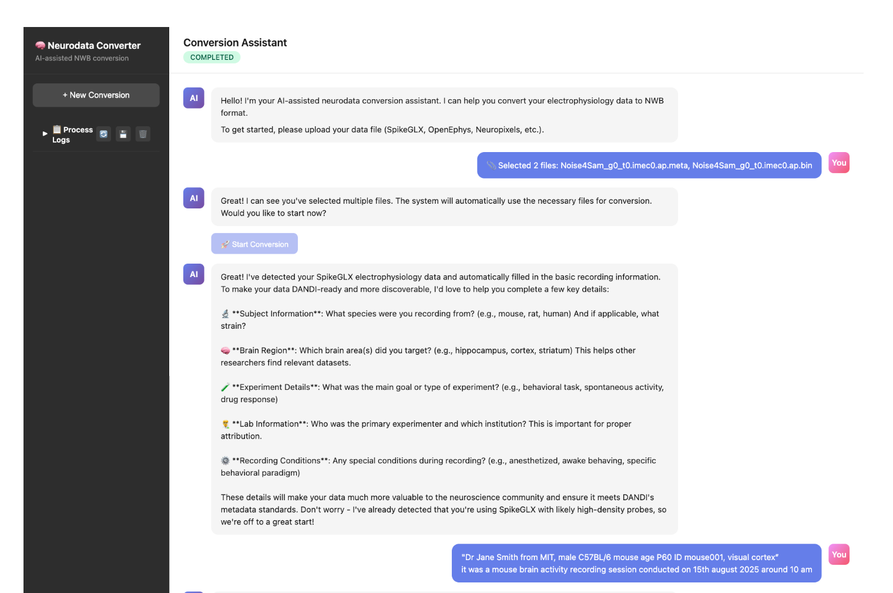
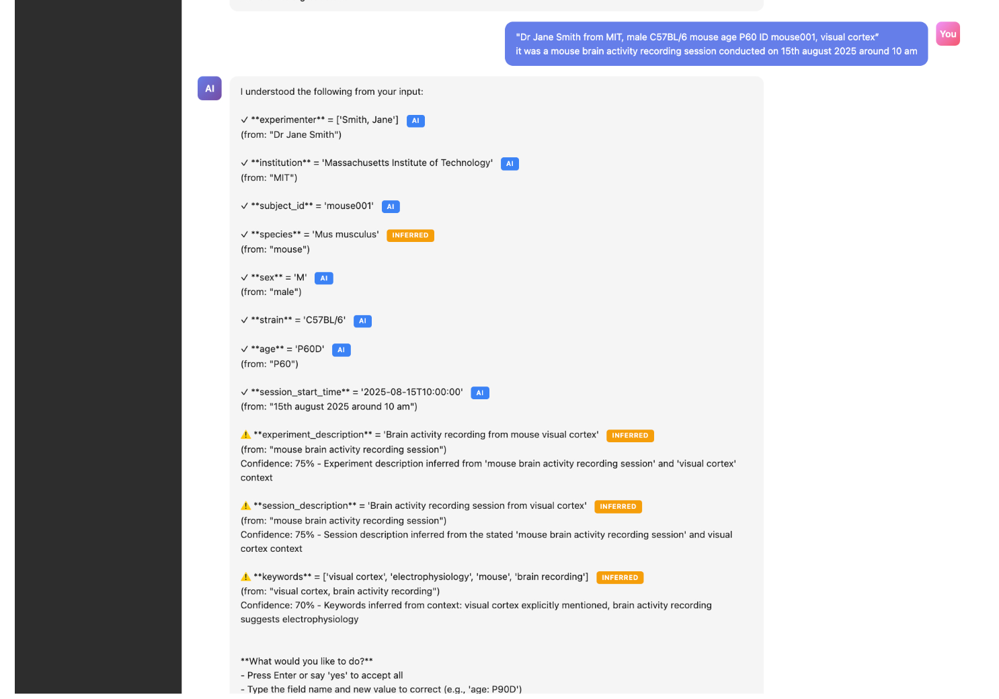
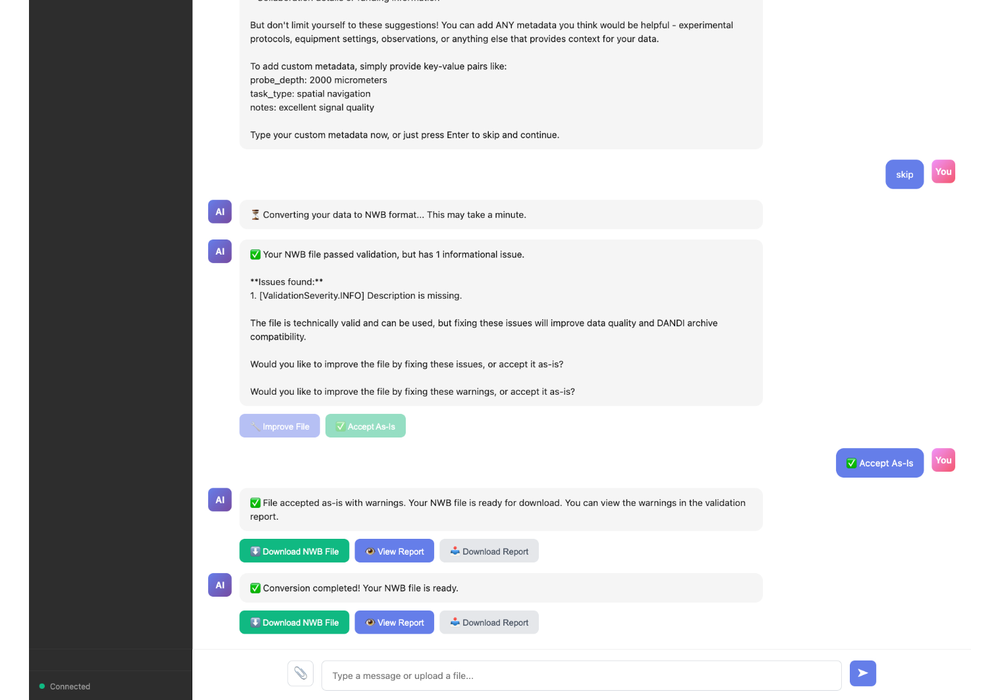
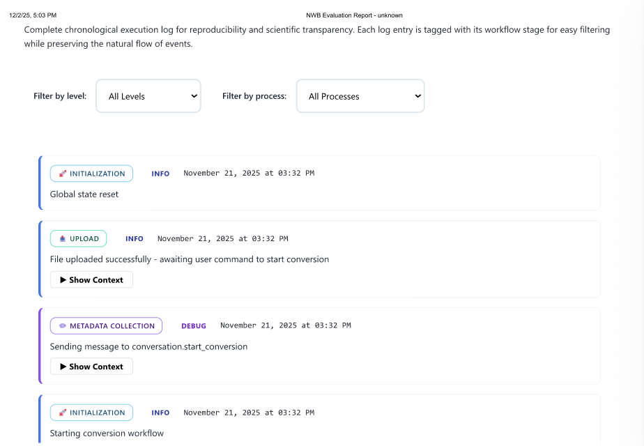
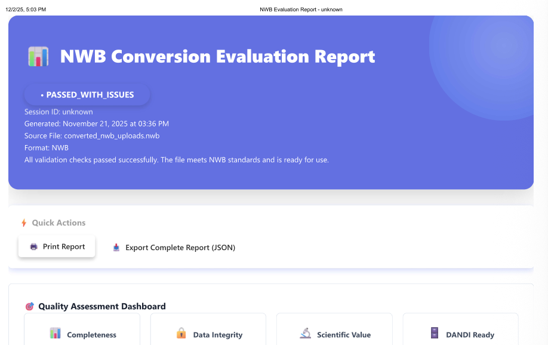
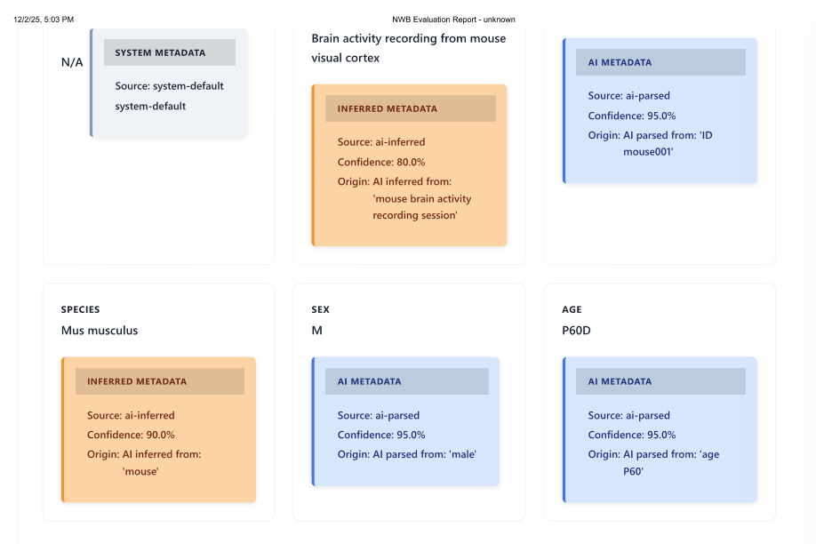

# Agentic Neurodata Conversion

Converts neuroscience electrophysiology data to NWB standard using a conversational AI interface powered by a multi-agent system.

[](https://github.com/Python-AI-Solutions/agentic-neurodata-conversion/actions/workflows/ci.yml)

This project demonstrates spec-driven development of an AI system that:

- Converts neuroscience data to NWB standard through a chat interface
- Uses a three-agent architecture (Conversation, Conversion, Evaluation) with provenance tracking

---

## Why It Matters

NWB conversion currently requires deep knowledge of both source formats and the NWB schema.
This system enables researchers to convert data through conversation, reducing the barrier
to DANDI archive submission and data sharing in neuroscience.

---

## Key Capabilities

**Multi-Agent Architecture**

- Three specialized agents (Conversation, Conversion, Evaluation) communicate via MCP protocol

**Provenance Capture**

- Traceability from raw data files through metadata collection to final NWB output
- Records metadata source (user input, filename inference or defaults) for each field
- Maintains conversation history and validation results for reproducibility

**Natural Language Metadata Collection**

- Reduces manual form-filling to a conversational interaction
- Automatic normalization to NWB/DANDI standards

**Automated Format Detection**

- Supports electrophysiology formats via NeuroConv integration

**Comprehensive Validation**

- NWBInspector integration for DANDI compliance checking
- Automated issue classification and analysis
- Structured validation reports with actionable feedback

---

## Architecture

### Agent Communication

Agents operate independently without cross-imports, communicating exclusively via MCP messages. This architecture enables testing agents in isolation and swapping implementations without cascading changes.

```
┌─────────────────────────────────────────────────────────────┐
│                  FastAPI Backend Server                     │
│  WebSocket + REST API + Session Management                  │
└───────────────────────┬─────────────────────────────────────┘
                        │
┌───────────────────────▼─────────────────────────────────────┐
│             MCP Server (Message Bus)                        │
│  Agent registration • Message routing • State management    │
└─────┬───────────────┬───────────────┬───────────────────────┘
      │               │               │
┌─────▼──────┐  ┌─────▼───────┐  ┌────▼──────┐
│Conversation│  │ Conversion  │  │Evaluation │
│   Agent    │  │   Agent     │  │  Agent    │
└────────────┘  └─────────────┘  └───────────┘
      │               │               │
┌─────▼───────────────▼───────────────▼───────────────────────┐
│                 Supporting Services                         │
│ • LLM Service (Claude Sonnet 4.5)                           │
│ • Metadata Parser (NLP + Schema Validation)                 │
│ • Format Detector • Validation Analyzer                     │
│ • Report Generator • Log Manager                            │
└──────────────────────┬──────────────────────────────────────┘
                       │
┌──────────────────────▼──────────────────────────────────────┐
│          External Tools & Libraries                         │
│  NeuroConv • SpikeInterface • PyNWB • NWBInspector          │
└─────────────────────────────────────────────────────────────┘
```
---

### Agent Responsibilities

**Conversation Agent** ([conversation_agent.py](agentic_neurodata_conversion/agents/conversation_agent.py))

- Orchestrates workflow phases (upload → metadata → conversion → validation)
- Manages user interactions and natural language understanding
- Routes messages between agents based on conversation state
- Handles retry decisions and error recovery

**Conversion Agent** ([conversion_agent.py](agentic_neurodata_conversion/agents/conversion_agent.py))

- Format detection using LLM analysis and rule-based validation
- Stream detection and selection for multi-stream recordings
- Metadata mapping to NWB schema with validation
- Data conversion via NeuroConv with error handling

**Evaluation Agent** ([evaluation_agent.py](agentic_neurodata_conversion/agents/evaluation_agent.py))

- NWBInspector validation execution
- Issue classification (critical vs. non-critical)
- Validation report generation with actionable feedback
- DANDI compliance verification

---

## Development Approach:  Built using spec-driven development methodology

This project uses **spec-driven development** methodology using **Spec-Kit by GitHub** :

**Constitutional Constraints**

- Project principles and design constraints documented in [.specify/memory/constitution.md](.specify/memory/constitution.md)
- All implementation decisions traceable to constitutional rules
- Prevents scope creep and ensures architectural consistency

**Phased Implementation**

- Each phase has explicit deliverables, verification criteria and tests
- Implementation guides define file structure, dependencies and acceptance criteria

**Grounding Mechanisms**

- **Semantic Layer**: Agent behavior constrained by NWB schema and DANDI validation rules
- **Testing**: Unit and integration tests created alongside implementation (60%+ coverage required)
- **Evaluation**: NWBInspector validation on every conversion output
- **Provenance**: Traceability of metadata sources and conversion decisions

**Code Quality**

- Pre-commit hooks enforce linting (Ruff), type checking (MyPy) and security scanning (Bandit)
- All agent I/O operations use async/await patterns
- Structured logging with correlation IDs for debugging

See [requirements.md](specs/requirements.md) for complete technical reference and development workflow.

---

## Quick Start

### Recommended: Automated Startup

The easiest way to run the application is using the startup script:

```bash
# Clone and navigate to project directory
git clone https://github.com/Python-AI-Solutions/agentic-neurodata-conversion.git
cd agentic-neurodata-conversion

# Install dependencies
pixi install

# Run the application (handles everything automatically)
python3 scripts/startup/start_app.py
```

The script will:

- Configure your .env file with API key (interactive prompt)
- Clean up old processes and temp directories
- Start backend server (port 8000)
- Start frontend server (port 3000)
- Display status and URLs

Access the interface at [http://localhost:3000/chat-ui.html](http://localhost:3000/chat-ui.html)

For detailed setup, development workflow, and testing instructions, see [CONTRIBUTING.md](CONTRIBUTING.md).

---

## Usage Example

1. **Upload Files**: Drag and drop electrophysiology data files (e.g., `.ap.bin` + `.meta` for SpikeGLX)
2. **Start Conversion**: Type "start conversion" in the chat interface
3. **Provide Metadata**: Describe your experiment in natural language:
   ```
   "I'm Dr. Jane Smith from MIT studying 8 week old male mice in visual cortex during visual stimulation"
   ```
4. **Confirm Understanding**: System displays parsed metadata with confidence scores
   ```
   experimenter: "Smith, Jane" (95%)
   institution: "Massachusetts Institute of Technology" (98%)
   subject_age: "P56D" (92%)
   subject_sex: "M" (100%)
   ```
5. **Download Results**: Converted NWB file and validation report ready for DANDI upload

---

## System Overview

### File Upload and Format Detection


*Add file with attach button with automatic format detection*

### Natural Language Metadata Collection


*Conversational interface for collecting experimental metadata - system extracts structured fields from natural language*

### Conversion Progress and Results


*Real-time conversion updates with validation results and download options*

### Validation Report - Overview


*Comprehensive validation report showing NWBInspector results with issue classification and DANDI compliance status*

### Validation Report - Detailed Analysis


*Detailed breakdown of validation issues with severity levels, affected fields, and actionable recommendations*

### Provenance Tracking


*Complete traceability of metadata sources - tracks whether each field came from user input, filename inference or defaults*

---

## Project Status

**Current Phase**: Knowledge Graph Integration (Phase 2)

- ✓ Multi-agent conversation workflow
- ✓ Format detection and conversion
- ✓ Validation and reporting
- In progress: Schema field normalization via knowledge graph

**Known Limitations**:

- Batch processing not yet supported
- Format detection may require confirmation for ambiguous cases

---

## Technical Stack

- **Backend**: FastAPI, Python 3.13+, Pixi package management
- **AI**: Anthropic Claude Sonnet 4.5 via claude-ai-client
- **Data Conversion**: NeuroConv, PyNWB, SpikeInterface
- **Validation**: NWBInspector, pynwb
- **Testing**: pytest, pytest-asyncio, pytest-mock
- **Code Quality**: Ruff, MyPy, Bandit, pre-commit hooks

---

## Documentation

- [CONTRIBUTING.md](CONTRIBUTING.md) - Development workflow and contribution guidelines
- [.specify/memory/constitution.md](.specify/memory/constitution.md) - Project principles
- [requirements.md](specs/requirements.md) - Project requirements

---

## License

This project is licensed under the MIT License - see the [LICENSE](LICENSE) file for details.

Copyright (c) 2024 Agentic Neurodata Conversion Team

---
