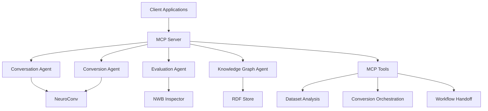

# System Architecture Overview

## High-Level Architecture

The Agentic Neurodata Conversion system is built around a central MCP (Model
Context Protocol) server that orchestrates multi-agent workflows for converting
neuroscience data to NWB format.

## Core Components

### MCP Server (Primary Orchestration Layer)

- Central coordination point for all system operations
- Exposes standardized tool interfaces for dataset analysis, conversion
  orchestration, and workflow handoff
- Manages internal agent lifecycle and communication
- Provides RESTful API and stdio interfaces for client integration

### Internal Agents

- **Conversation Agent**: Handles dataset analysis and metadata extraction
  through LLM interactions
- **Conversion Agent**: Generates and executes NeuroConv conversion scripts
- **Evaluation Agent**: Performs quality assessment of generated NWB files
- **Knowledge Graph Agent**: Manages semantic enrichment and provenance tracking

### External Integrations

- **NeuroConv**: Core conversion library for neuroscience data formats
- **NWB Inspector**: Quality assessment and validation of NWB files
- **LinkML**: Schema validation and metadata normalization
- **RDF Store**: Knowledge graph storage and querying

## Design Principles

1. **MCP-Centric Architecture**: All functionality exposed through standardized
   MCP tools
2. **Agent Orchestration**: Internal agents handle specialized tasks under MCP
   server coordination
3. **Modular Integration**: Clean interfaces for external tools and libraries
4. **Stateful Pipeline**: Pipeline state management for complex multi-step
   workflows
5. **Client Flexibility**: Multiple interface options (REST API, stdio, Python
   client)

## Data Flow

1. **Dataset Analysis**: Client requests analysis → MCP server → Conversation
   agent → Metadata extraction
2. **Conversion Orchestration**: Normalized metadata → Conversion agent →
   NeuroConv script generation → NWB file creation
3. **Quality Assessment**: NWB file → Evaluation agent → NWB Inspector → Quality
   report
4. **Knowledge Enrichment**: Metadata + NWB → Knowledge Graph agent → Semantic
   annotations

## Scalability Considerations

- Stateless MCP server design enables horizontal scaling
- Agent isolation allows independent scaling of specialized components
- External tool integration through well-defined interfaces
- Pipeline state persistence for long-running workflows
